# School District Analysis

## Overview of Project

A school board gave me the task of analyzing testing data from the school district they oversaw. 
Board members wanted me to summarize data at a district and school level as well as review the performances of specific schools and average reading and math scores by grade level. 
District officials also wanted to look at scores by school spending per student, by school size and by school type.

Once I did an initial analysis, officials discovered that data collected from the district showed evidence of academic dishonesty, specifically the reading and math test scores for Thomas High School ninth graders.

### Purpose

The purpose of this analysis is to replace the math and reading scores for Thomas High School ninth graders, making them null, and then describe how this change affected the results of my analysis.

## Resources

- Data Source: schools_complete.csv
- Software: JupyterLab 2.1.5, Pandas 1.0.5

## Analysis and Challenges

To conduct this analysis, I used JupyterLab and Pandas which allowed me to format and conduct my analysis more easily and more quickly than if I had used Excel.

### Analysis Description

To replace the ninth grade reading and math scores, I used the Pandas `loc` method with conditional statements and logical operators.

With the code below, I selected the ninth-grade reading and math scores for Thomas High School and then used Pandas NumPy module to change the reading and math scores to NaN.

```ipynb
# Replace the 9th grade reading and math scores at Thomas High School with NaN and begin by importing dependencies
import numpy as np

# replace 9th grade reading scores with NaN
student_data_df.loc[(student_data_df["school_name"] == "Thomas High School") & (student_data_df["grade"] == "9th"), "reading_score"] = np.nan

# replace 9th grade math scores with Nan
student_data_df.loc[(student_data_df["school_name"] == "Thomas High School") & (student_data_df["grade"] == "9th"), "math_score"] = np.nan
```
After I replaced the falsely reported test scores, I then performed an analysis summarizing the data to produce:

- District summary
- School summary
- Chart of top 5 and bottom 5 performing schools, based on the overall passing rate
- Average math score for each grade level from each school
- Average reading score for each grade level from each school
- Scores by school spending per student, by school size, and by school type

I compared the results of the updated summary with a summary of the unaltered data to describe how the changes I made affected the results of the analysis.

### Challenges and Difficulties Encountered

The tricky part of this analysis was that I had never used Jupyter Notebook, so there was a steep learning curve in terms of familiarizing myself with the syntax and becoming used to checking data types and formatting.

With the help of Google, however, I was able to discover syntax and review methodology.

## Results

- Looking at the original and updated results, it is clear that the total students and budgets remained the same because those numbers did not change with my analysis.

    The average reading scores remained the same while the average math score dropped .1 points from the original to the updated analysis. 

    As far as the percent passing categories, math, reading and overall passing dropped one percentage point.

    The minimal affect of the data change indicates that the academic dishonestly had a minor affect at the district-level summary. 
    To verify this observation, the district should preform a statistical significance test to find the p-value of my observation. 
  
    Original result:

    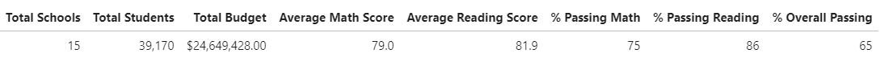

    Updated result:

    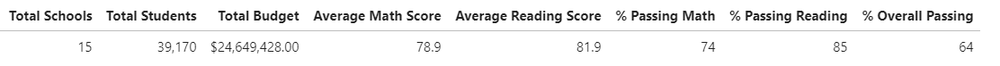

- The school summaries of the data reveal minimal changes for the difference between the average math and reading scores. However, when looking at the percent of students who passed the reading and math tests, the cheating made a difference. 

    The overall passing percentage for both exams dropped 26 percent and reading reduced 27 percent and math 26 percent.

    Original results:
    
    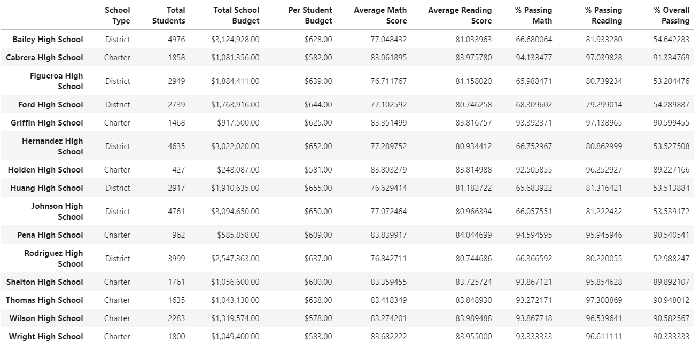

    Updated results:

    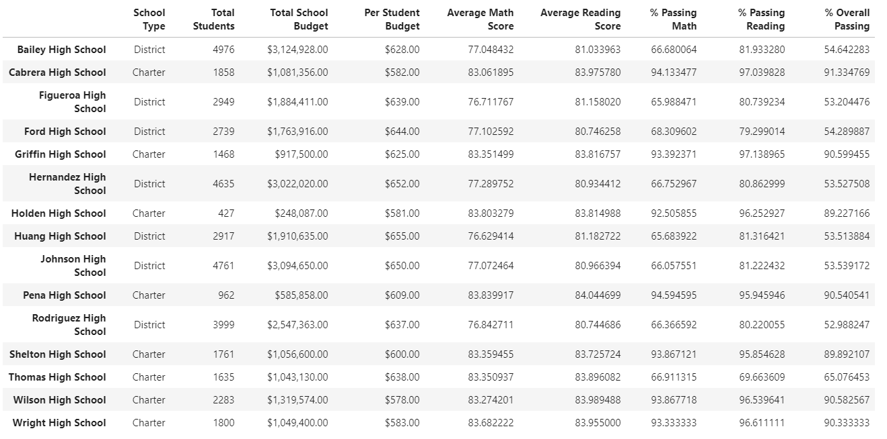

- Replacing the ninth graders’ math and reading scores dropped Thomas High School’s performance relative to the other schools based on overall passing rates.
  In the original results, Thomas High School ranked second out of all the schools, but then dropped to 8th out of the 15 schools. 

    Original top five ranked results:

    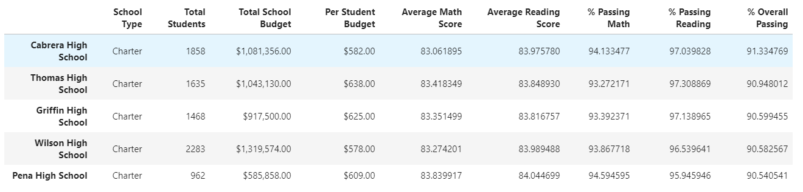

    Updated top five ranked results:

    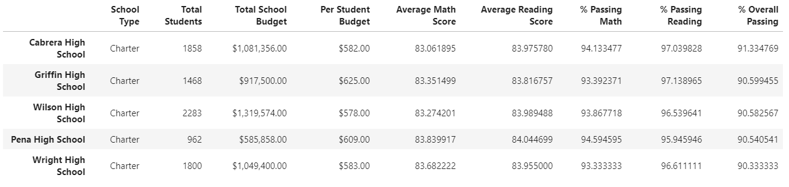

- Replacing the ninth-grade scores affected the following:
  - The original and updated summaries for math and reading scores by grade show that the evaluating the scores of ninth graders at Thomas High School is impossible.
    We have no numbers for the students, and the data we have can give us no information about how those students actually performed on the exams. This also hinders our ability to assess the education the students are receiving.

    Original math sores by grade:

    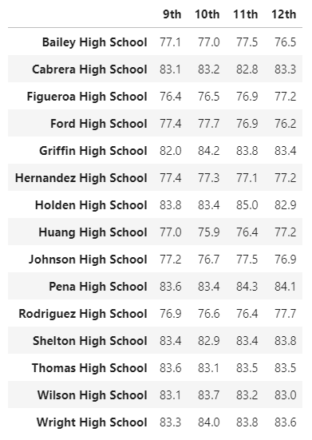

    Edited results:

    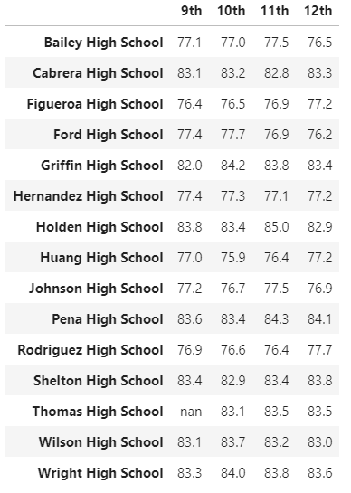

    Original reading scores by grade:

    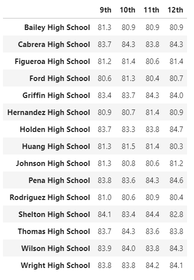

    Edited results:

    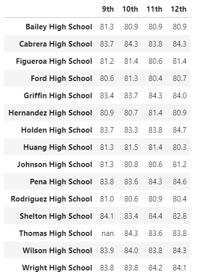

- Scores by school spending show that nothing changed for the average math scores and reading scores, which is in line with the other results of the analysis.
  However, the percent passing math and reading in the $630 - $644 spending per student range (which is the category Thomas High School belongs to) dropped by 7 percent for the percent passing reading category and 6 percent for the percent passing math category, with an overall 7 percent reduction in the percent of students who passed both tests.
    
    Original results:

    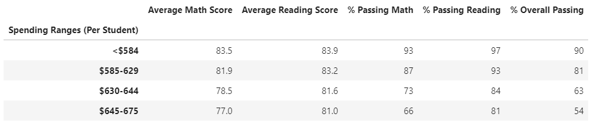

    Edited results:

    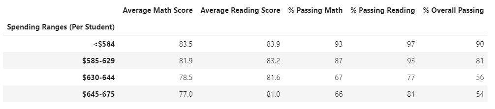

- The scores evaluated by school size show a similar trend to the analysis of spending ranges, with a 6 percent drop in all the percent passing categories.

    Original results:

    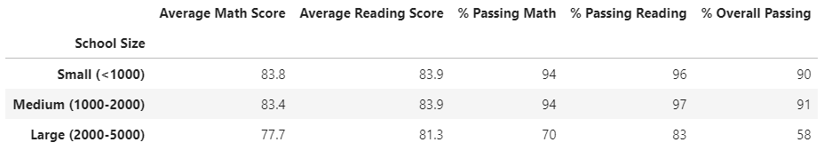

    Edited results:
    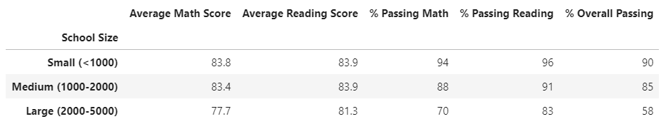

- Analysis of the scores by school type reveal that even though Thomas High School was a charter school, charter schools still had higher rates of passing students and higher average test scores across the board.

    Original results:

    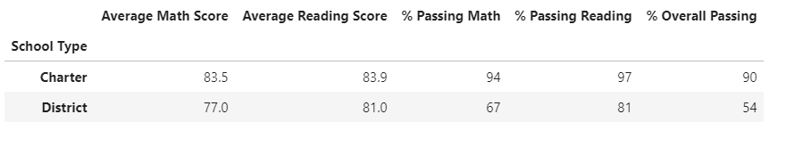

    Edited results:
    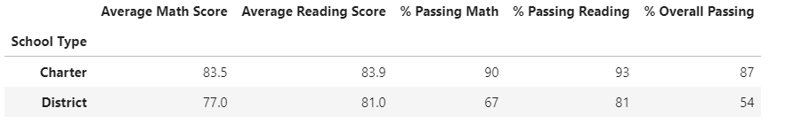


## Summary

The four major changes in the updated school district analysis after reading and math scores for the ninth grade at Thomas High School have been replaced with NaNs show:

1. The school summaries of the data reveal minimal changes for the difference between the average math and reading scores. However, when looking at the percent of students who passed the reading and math tests, the cheating made a  noticeable difference.
2. Replacing the ninth graders’ math and reading scores with NaN caused Thomas High School’s overall performance to drop from second to eighth out of the 15 schools, placing them solidly in the middle of the set of schools.
3. The percent passing math and reading in the $630 - $644 spending per student range (which is the category Thomas High School belongs to) noticeably reduced passing rates in all three categories indicating that more analysis on whether this level of student spending is effective should be performed.
4. The original and updated summaries for math and reading scores by grade show that the evaluating the scores of ninth graders at Thomas High School is impossible.
    We have no numbers for the students, and the data we have can give us no information about how those students actually performed on the exams. We also cannot evaluate the success of ninth graders education at Thomas High School with this data.